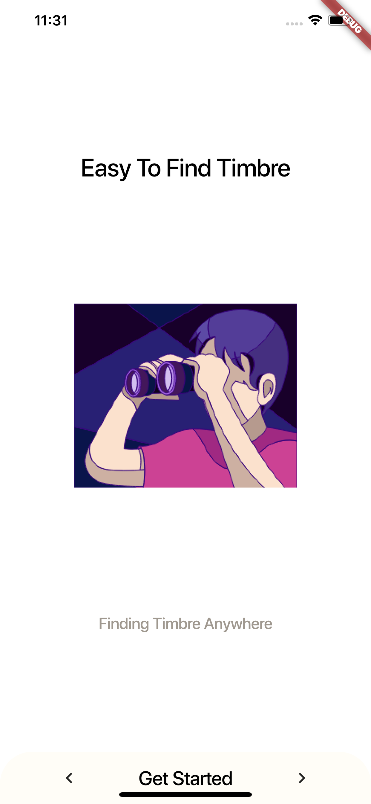

# UTS PEMROGRAMAN MOBILE

Anggota Kelompok :
-	Anton Kurniawan
-	Angga Dwi Saputra
-	Dimas Prasetyo
Materi Tugas : Membuat Mock Up suatu Start Up.

Nama Start Up : Timbre. 
Konsep : Aplikasi penyewaan perangkat Audio ( seperti : Headphone, Earphone, Bluetooth Speaker ). Konsepnya mirip seperti Start Up ReCharge Indonesia, yakni penyewaan PowerBank.

# Halaman Awal

# Halaman Awal

